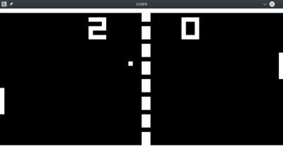

# Chip8

The Chip8 program emulates [CHIP-8](https://en.wikipedia.org/wiki/CHIP-8) and allows to
run the original machine code of programs which has been written for this virtual machine.


### Used technologies
* Spring context
* JavaFX
* Log4j
* JUnit

### Installing

Install JavaFX using package manager i.e
```
sudo apt-get install openjfx
```

Clone and build
```
git clone https://github.com/b-liw/Chip8.git
cd Chip8
mvn package
```

### Running
```
cd Chip8/target
java -jar ./Chip8.jar
select one of available roms from Chip8/programs/ folder
```

## Running the tests

```
cd Chip8
mvn test
```

## Built With

* [Maven](https://maven.apache.org/) - Dependency Management

## License

This project is licensed under the MIT License - see the [LICENSE](LICENSE) file for details
